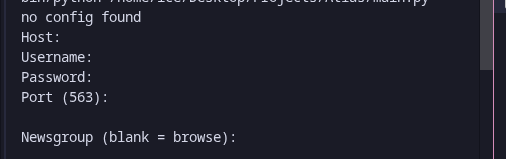
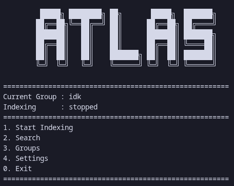

# Atlas

this is a self hosted usenet indexer
it indexes newsgroups into a local SQLite database

## Features

1) **NNTP indexing** :-
   connects to nntp over ssl

2) **Dynamic indexing** :-
   indexer can switch between modes - backfill only, live only, or dynamic which does both

3) **release parsing** :-
   it can handle multiple subject formats and detects complete and broken releases

4) **local database** :-
   db is stored as `atlas.db` it stores groups, releases, articles, and indexing states

5) **Terminal UI** :-
   UI is simple and fast it also includes pagination

6) **NZB generation** :-
   generates NZB 1.1 files locally

7) **SABnzbd integration** :-
   it includes SABnzbd 5.0.4 and u can download files directly without leaving atlas, it auto configs with your NNTP provider

8) **Background indexing** :-
   indexer runs separately from the main terminal UI
   start and stop without leaving atlas and progress state is saved in a local file

## Installation

### requirements
- `requirements.txt`
- An NNTP provider account
- An NNTP server with SSL support

### clone

```bash
git clone https://github.com/Eraxty/Atlas
cd Atlas
```

### create a venv

```bash
python -m venv .venv
source .venv/bin/activate
```

### install dependencies

```bash
pip install -r requirements.txt
```

### running the program

```bash
python main.py
```

## Setup


configure the indexer with the credentials your usenet provider gave you
the config is stored locally as `config.json`
u can change that anytime in the settings menu or by editing it directly

## Usage

after starting atlas u will be greeted by this menu


here u can index, search, select groups and change config and indexer settings

## Downloading

after picking a group and indexing it articles will start to appear u can select them and u have the option to make an NZB or download

selecting download starts SABnzbd if it is not already running, generates an NZB for the selected release, and drops it into SABnzbd's watched directory which downloads it

making an NZB on the other hand creates a nzb file which u can give to any usenet downloader and u can download it from there

## Release

this release is intended for:

- Architecture: x86_64
- OS: Arch Linux

## License

[WTFPL](LICENSE) 
