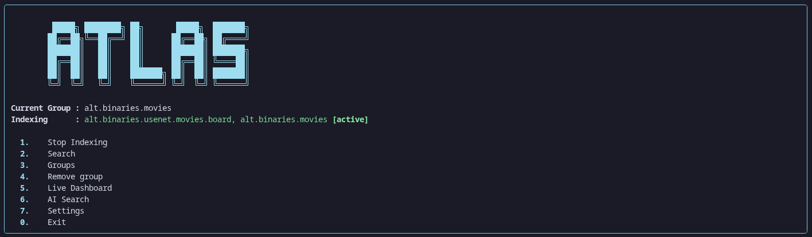
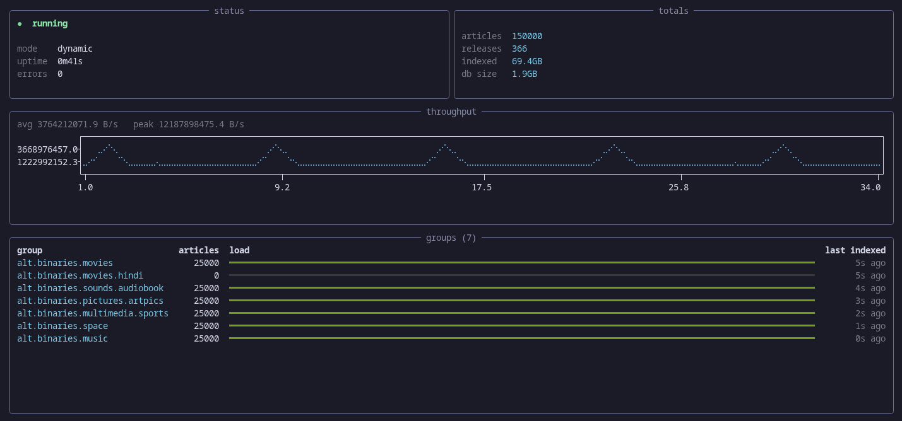

<div align="center">

# Atlas

A self hosted Usenet indexer that lives in your terminal.

[](LICENSE)

-informational)


[Features](#features) • [Install](#installation) • [Usage](#usage) • [Docker](#docker) • [Newznab API](#newznab-api-generic)



</div>

---

## Why Atlas

I built Atlas because I wanted a Usenet indexer I could understand and control. A lot of options are paid services or heavy stacks full of moving parts. Atlas keeps the useful parts in one place: it reads your provider, works out which posts belong together, stores them locally, and makes an NZB when you find something.

You can use it yourself in the terminal. If you already run Prowlarr, SABnzbd, or the *arr apps, its Newznab API plugs into that setup too.

## Features

- Index selected NNTP groups over SSL in live, backfill, or mixed modes.
- Parse subjects into releases and mark incomplete sets.
- Search locally, with optional AI through Ollama.
- Watch indexing progress and group health in the terminal.
- Generate NZBs and send downloads to the bundled SABnzbd.
- Keep data in a local SQLite database, with Docker and Prowlarr setup included.



## Installation

You need:

- Python 3.10+
- A Usenet provider account (NNTP, SSL enabled)

```bash
git clone https://github.com/Eraxty/Atlas
cd Atlas
python -m venv .venv
source .venv/bin/activate
pip install -r requirements.txt
python main.py
```

Prefer containers? Skip to [Docker](#docker).

### Binaries

Atlas also ships pre built binaries on the [releases page](https://github.com/Eraxty/Atlas/releases).

#### Linux

1. Download `atlas-linux`.
2. Make it executable and run it:

```bash
chmod +x atlas-linux
./atlas-linux
```

First run creates `config.json` next to the binary.

#### Windows

1. Download `atlas-windows.zip`.
2. Extract it. It contains both `atlas-windows.exe` and `atlas.bat`.
3. Double-click `atlas.bat`. It opens a terminal and starts Atlas.

Or run it manually from a terminal:

```powershell
cd atlas-windows
.\atlas-windows.exe
```

#### macOS

1. Download `atlas-macos`.
2. Make it executable and run it:

```bash
chmod +x atlas-macos
./atlas-macos
```

## Usage


### First time setup

On first run, Atlas asks for your provider credentials:

| Field | What to enter |
|---|---|
| Host | Your provider's NNTP server. Use the domain only, e.g. `news.your-provider.net` |
| Username | Your provider username |
| Password | Your provider password |
| Port | `563` for SSL. Leave the default as it is |

Your password is stored in your OS keyring when possible. If keyring isn't available it falls back to `config.json`.

### Selecting groups

Go to Groups → search → add. Text-only groups are filtered out by default, and empty groups never show up.

### Indexing

> Note: indexing reads headers from the Usenet source server. It does not scan your computer.

Start the indexer from the main menu. Atlas begins pulling headers for every group you've selected. It also fires up the bundled SABnzbd in the background so downloads are ready when you want them. Pick a mode depending on what you need:

| Mode | Behavior |
|---|---|
| `dynamic` | Alternates backfill and live passes, keeping up with new posts while building history |
| `backfill` | Indexes backward from the latest release only |
| `live` | Indexes forward from the latest release only and ignores older posts |

### Searching

Two search scopes are available:

- Current group: search only the group you are in
- All groups: search everything you have indexed

AI search lets you describe what you want in plain language (`find me 4k hdr movies`). Atlas works out the groups and keywords, then fetches anything missing from your database. It needs [Ollama](https://ollama.com) running locally with the `qwen3:4b` model. Speed depends on your hardware.

### Downloading

Select a release and choose to generate an NZB or download directly. Downloading will:

1. Start SABnzbd if it isn't already running
2. Generate an NZB for the selected release
3. Drop it into SABnzbd's watched folder
4. Open SABnzbd in your browser so you can watch progress

Finished files land in `~/Downloads/complete`.

### Settings

- Change config: edit server credentials or groups without a full reset
- Change indexer mode: use the same three modes as above
- Purge broken releases: delete incomplete releases and free space
- Wipe DB and cache: clear the database, logs, status, and stats (stop the indexer first)
- Change API port: move the Newznab API off `9090` if that port is taken

## Docker

### Prebuilt image

No need to build locally just pull and run:

```bash
docker pull ghcr.io/eraxty/atlas:latest
```

```bash
docker run -dit --name atlas \
  -e ATLAS_NNTP_HOST=news.your-provider.net \
  -e ATLAS_NNTP_USER=youruser \
  -e ATLAS_NNTP_PASS=yourpass \
  -e ATLAS_API_HOST=0.0.0.0 \
  -p 9090:9090 \
  -v atlas-data:/app/data \
  ghcr.io/eraxty/atlas:latest
```

needs `-it` because Atlas is a terminal app, and `ATLAS_API_HOST=0.0.0.0` lets the API be reached from outside the container.

Check if it's running:

```bash
curl http://localhost:9090/api?t=caps
```

### Fresh Setup (compose stack)

The compose file runs Atlas, SABnzbd, and Prowlarr on one Docker network. They use service names instead of host IPs. Atlas reaches SABnzbd at `sabnzbd:8080` because they share the SABnzbd config volume.

1. Fill in your provider credentials in `docker_compose.yml`:
   - `ATLAS_NNTP_HOST`, `ATLAS_NNTP_USER`, `ATLAS_NNTP_PASS`

2. Bring it all up:

   ```bash
   docker compose -f docker_compose.yml up -d
   ```

3. Grab the Atlas API key (generated on first run, can also find in config.json):

   ```bash
   docker compose -f docker_compose.yml logs atlas | grep "api key"
   ```

4. Point Prowlarr at Atlas:
   - Open Prowlarr at `http://localhost:9696`
   - Go to Indexers → Add Indexer → Newznab
   - Name: `Atlas`
   - URL: `http://atlas:9090` (service name, same network)
   - API Path: `/api`
   - API Key: the key from step 3
   - Category: `Other` (7000)
   - Run Test. It should be green, then save the indexer

Atlas is exposed on `http://localhost:9090` for Prowlarr-on-the-host setups too.

#### Verifying the stack

Run these two checks:

```bash
docker compose -f docker_compose.yml ps
curl http://localhost:9090/api?t=caps
```

The first should show `atlas`, `sabnzbd`, and `prowlarr` as `Up`. The second should return `<caps>` XML. This endpoint does not need an API key, so a `200` response means Atlas is up and serving.

Atlas opens its setup wizard when the NNTP credentials are empty. Fill in `ATLAS_NNTP_USER` and `ATLAS_NNTP_PASS` in the compose file, then run `docker compose up -d --force-recreate atlas`.

Stop everything with:

```bash
docker compose -f docker_compose.yml down
```

Rebuild after code changes with:

```bash
docker compose -f docker_compose.yml up -d --build
```

### Existing arr stack (just add the Atlas indexer)

Already running SABnzbd and Prowlarr? You don't need the full stack, run Atlas alone and point it at your existing services.

1. Run only Atlas (swap `docker build` + `atlas` for `docker pull ghcr.io/eraxty/atlas:latest` if you don't want to build):

   ```bash
   docker build -t atlas .
   docker run -d --name atlas \
     -e ATLAS_NNTP_HOST=news.your-provider.net \
     -e ATLAS_NNTP_USER=youruser \
     -e ATLAS_NNTP_PASS=yourpass \
     -e ATLAS_SAB_HOST=172.17.0.1 \
     -e ATLAS_SAB_PORT=8080 \
     -e ATLAS_API_HOST=0.0.0.0 \
     -p 9090:9090 \
     -v atlas-data:/app/data \
     atlas
   ```

   `ATLAS_SAB_HOST` points to your SABnzbd. Use `172.17.0.1` when it runs on the host, `host.docker.internal` on Docker Desktop, or the service name of its container. `ATLAS_API_HOST=0.0.0.0` is required here so the published port can reach the API. Without it, Atlas defaults to `127.0.0.1` and stays on localhost.

2. Get the API key from the logs:

   ```bash
   docker logs atlas | grep "api key"
   ```

3. Add Atlas to your existing Prowlarr as a Newznab indexer:
   - Name: `Atlas`
   - URL: `http://<host-or-ip>:9090`
   - API Path: `/api`
   - API Key: the key from step 2
   - Category: `Other` (7000)
   - Run Test, then save

### Environment variables

Set these in `docker_compose.yml` (fresh setup) or on `docker run` (existing stack):

| Variable | Description |
|---|---|
| `ATLAS_NNTP_HOST` | Your provider's server |
| `ATLAS_NNTP_PORT` | Default `563` |
| `ATLAS_NNTP_USER` | Your username |
| `ATLAS_NNTP_PASS` | Your password |
| `ATLAS_INDEX_MODE` | `dynamic` / `live` / `backfill` |
| `ATLAS_API_PORT` | Port for Atlas's Newznab API. Defaults to `9090` |
| `ATLAS_API_HOST` | Interface the API binds to. Defaults to `127.0.0.1` (localhost only). Set to `0.0.0.0` to accept connections from other hosts or containers. The compose stack sets this so Prowlarr can reach Atlas over the Docker network |
| `ATLAS_SAB_HOST` | Hostname of your SABnzbd (`sabnzbd` in the compose stack) |
| `ATLAS_SAB_PORT` | SABnzbd's port. Defaults to `8080` |

## Newznab API (Generic)

Atlas exposes a generic Newznab-compatible API, the protocol used by Prowlarr, Sonarr, Radarr, and SABnzbd. Any compatible client can search releases and fetch NZBs.

- Endpoint: `http://<host>:<port>/api`. The port defaults to `9090`.
- Binding: the API listens on `127.0.0.1` by default. Set `ATLAS_API_HOST=0.0.0.0` to expose it to other machines or containers.
- Authentication: `t=caps` works without a key. Every other operation needs the `apikey` parameter. A missing or wrong key returns a `401` Newznab error.

### Operations

| `t=` | Meaning | Auth |
|---|---|---|
| `caps` | Capability discovery (server info, supported params, categories) | No |
| `search` | Release search. `q` is optional; an empty query returns recent releases | Yes |
| `get` | Download the NZB for a release by `id` | Yes |

### Parameters

| Param | Applies to | Description |
|---|---|---|
| `apikey` | all (except `caps`) | Your API key |
| `q` | `search` | Plain-word search terms matched against release names |
| `cat` | `search` | Accepted for compatibility; Atlas currently indexes category `7000` (Other) only |
| `limit` | `search` | Max results, default `100`, clamped to `100` |
| `offset` | `search` | Result offset for pagination |
| `id` | `get` | Release ID from a search result's `<guid>` |

### Examples

```bash
# capabilities (no auth)
curl "http://localhost:9090/api?t=caps"

# search releases, key required
KEY=$(jq -r .api_key config.json)
curl "http://localhost:9090/api?t=search&apikey=$KEY&q=matrix&limit=25"

# download the NZB for a specific release
curl -O "http://localhost:9090/api?t=get&id=1234&apikey=$KEY"
```

### Capabilities

`t=caps` advertises search (`q`, `limit`, `offset`, with up to 100 results), one category (`7000`, Other), and no registration. That is why Prowlarr should use category `Other (7000)` during setup.

### Search results

Each `<item>` carries Newznab-compatible metadata:

- `<title>`: release name
- `<guid>`: release ID, used with `t=get`
- `<link>` / `<enclosure>`: NZB download URL
- `<size>`: total size in bytes
- `<pubDate>`: posted date in RFC 2822 format
- `<newznab:attr name="category" value="7000"/>`: category

Prowlarr reads these to evaluate hits and hands the `<enclosure>` URL (Atlas's `t=get` endpoint) to the downloader. `t=get` responds with `application/x-nzb` and a `Content-Disposition` attachment header containing a valid NZB 1.1 file built from the indexed articles, so SABnzbd can grab it straight off the URL.

### Backing up the database

The database lives in a Docker volume. Make sure the compose service is running, then:

```bash
docker compose -f docker_compose.yml exec atlas cp /app/data/atlas.db /app/atlas.db
docker cp atlas:/app/atlas.db ./backup.db
```

## Platform

Tested on Arch Linux, x86_64. Other Linux distros may work but aren't officially verified.

## Limitation

Partial deobfuscation support via par2
Windows exe and Mac build might not work properly

## Credits

Built by [Me](https://github.com/Eraxty) over 50 days and 80 hours. It is my biggest project so far. Thanks to the Hack Club community for the push to build something like this.

AI helped with bug fixes, refactoring, SABnzbd integration, the background indexer, and terminal UI polish.

## License

[GPL-3.0](LICENSE). Bundled SABnzbd is GPL-2.0-or-later and remains under its own license.
