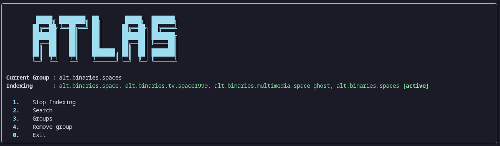
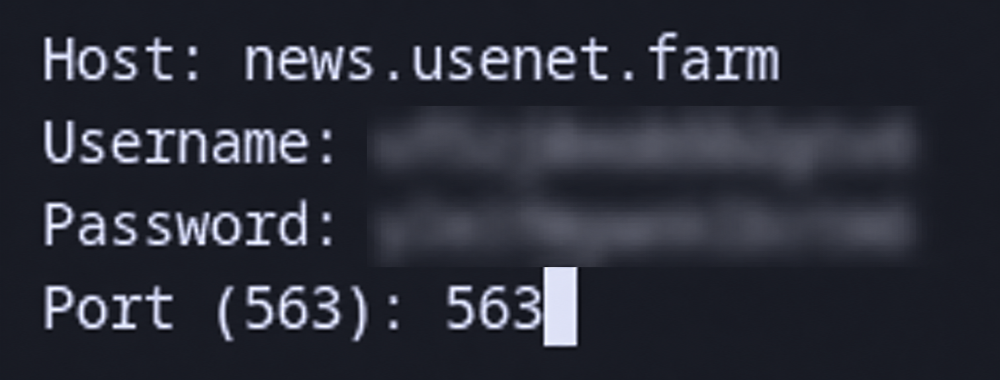

# Atlas

self hosted usenet indexer
indexes newsgroups into a local SQLite database

## Features

- **NNTP indexing** - connects over SSL can index multiple groups at once
- **Dynamic indexing** - switch between backfill only, live only, or dynamic mode
- **release parsing** - handles multiple subject formats, detects complete/broken releases
- **local database** - stores groups, releases, articles, and indexing states in `atlas.db`
- **Terminal UI** - rich formatted menus, tables, and pagination
- **NZB generation** - generates NZB 1.1 files locally
- **SABnzbd integration** - bundled SABnzbd 5.0.4, auto configs with your provider, opens in browser on download
- **Background indexing** - runs separately from the UI, start/stop without leaving atlas
- **multi group indexing** - index multiple groups at the same time
- **remove groups** - remove specific groups from the index list from the main menu

## Installation

### requirements
- `requirements.txt`
- A NNTP provider account
- A NNTP server with SSL support

### clone

```bash
git clone https://github.com/Eraxty/Atlas
cd Atlas
```

### create a venv

```bash
python -m venv .venv
source .venv/bin/activate
```

### install dependencies

```bash
pip install -r requirements.txt
```

### running the program

```bash
python main.py
```

## Usage



U can index, search, select groups, remove groups, and change config and indexer settings


---

## How to use

### first time setup

when u first run atlas it will ask for your usenet provider credentials



fill in the fields like this:

- **Host** - put your providers NNTP server address like `news.usenet.farm` (just the domain, no https or anything)
- **Username** - your provider username
- **Password** - your provider password
- **Port (563)** - leave as `563` thats the SSL port

press enter

### selecting groups

go to groups from the main menu, it'll show u all available groups on the server. search for what u want and add

### indexing

go back to the main menu and start indexer. atlas will start downloading headers from your selected groups. 

### indexer modes 

- **dynamic mode**:- it'll backfill old articles first then switch to live for new ones and repeats 
- **backfill**:- it only indexes back from the latest release
-  **live**:- it only indexes after the latest release nothing before it

### Searching 
There are currently 2 search modes **current group** and **all groups**

1) **current group** only searches stuff in the group u have selected 
2) **all groups** searches in all the groups u have indexed  


### Downloading

after picking a group and indexing it articles will start to appear u can select them and u have the option to make an NZB or download

selecting download starts SABnzbd if it is not already running, generates an NZB for the selected release, and drops it into SABnzbd's watched directory which downloads it. it also opens SABnzbd in your browser so u can see the progress


---

## Release

this release is intended for:

- Architecture: x86_64
- OS: Arch Linux

## Special Thanks
special thanks to hackclub community for inspiring me to make this project cuz ever since i was in this community it always pushed me to build something good this is my biggest and largest project yet it took me 40+ days and 50+ hours to make this 

## AI usage 
- AI was used to help stuff like fixing bugs, improve, refactor parts of the db, SABnzbd integration, and improving the terminal UI and Rich formatting 

## License

[WTFPL](LICENSE) 
