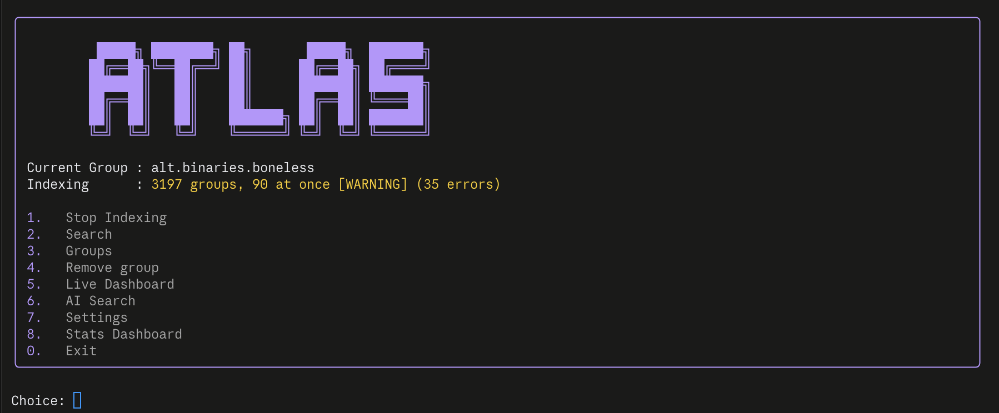
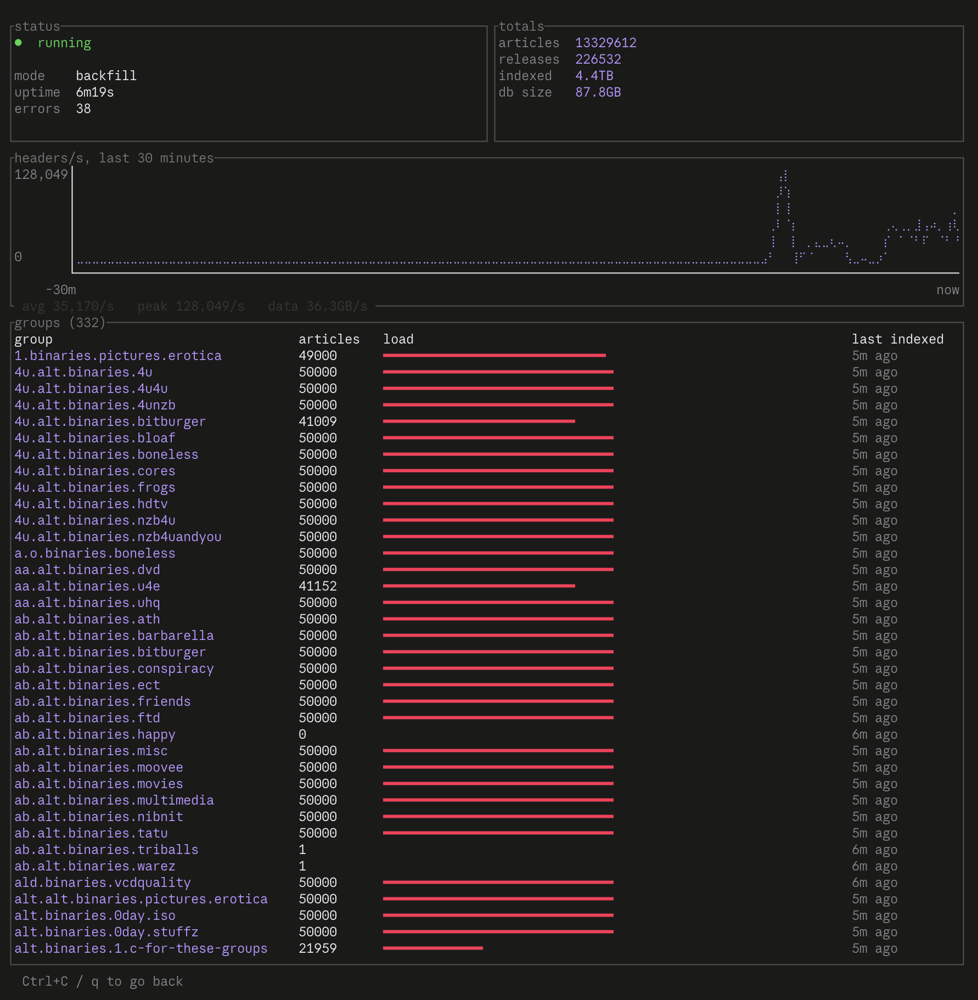
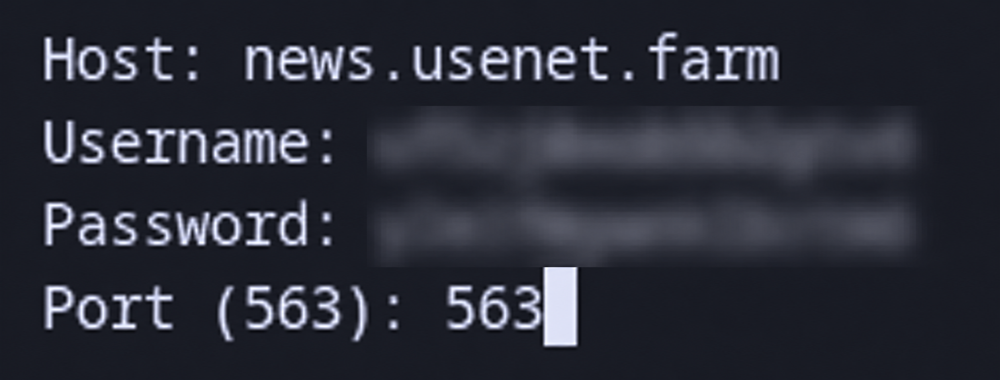
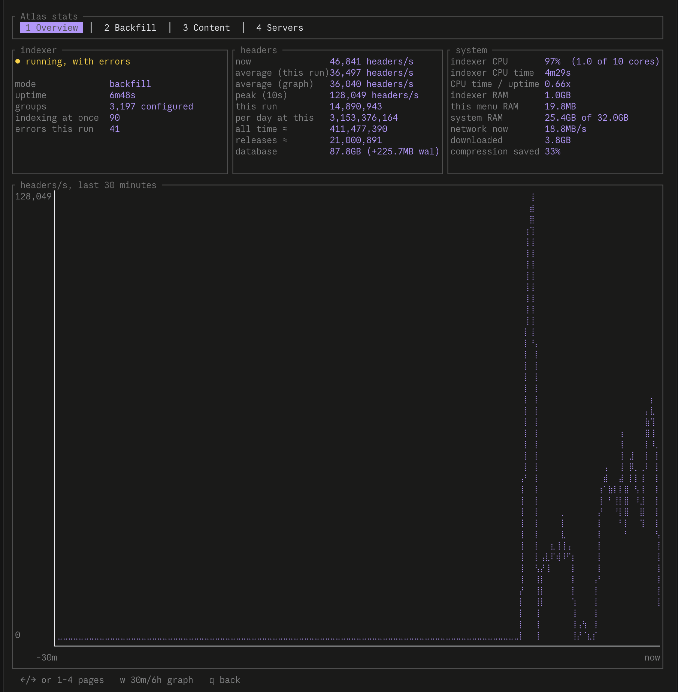
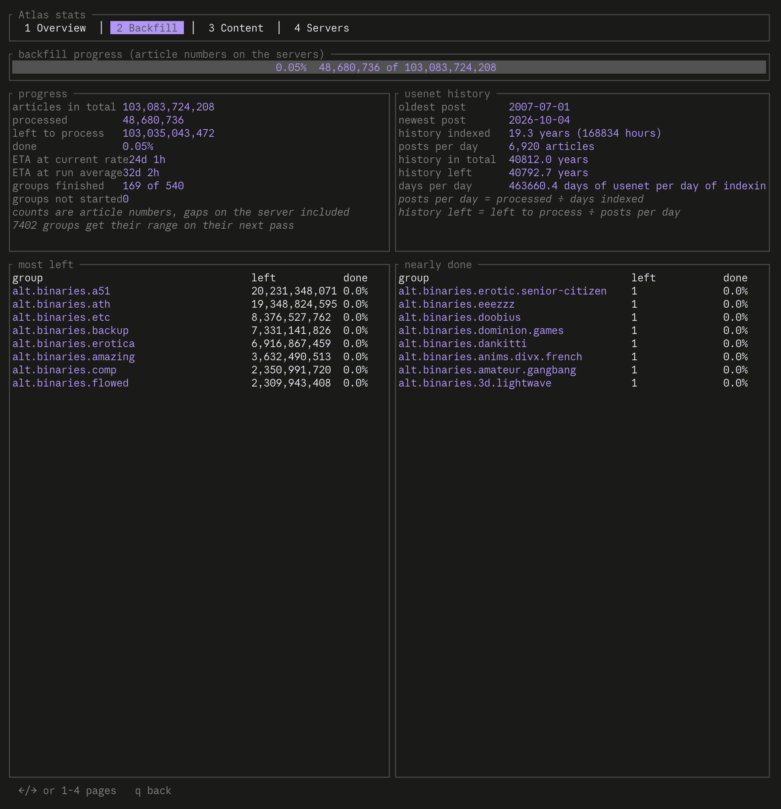
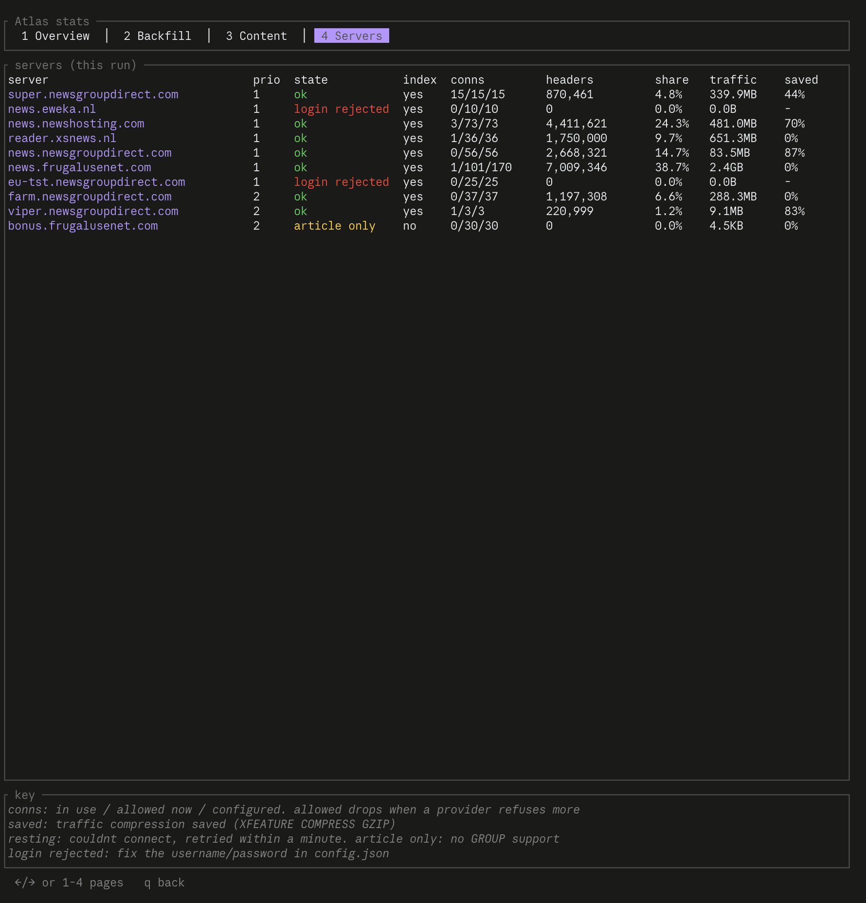

<div align="center">

# Atlas

A self-hosted Usenet indexer and Newznab server that runs in your terminal

[](https://www.rust-lang.org)

[](LICENSE)


[Features](#features) • [Rust](#built-with-rust) • [Install](#installation) • [config.json](#configure-atlas-configjson) • [Usage](#usage) • [Stats dashboard](#stats-dashboard) • [Newznab API](#newznab-api) • [Development](#development)



</div>

---

## Why Atlas

Many Usenet indexers charge a fee. Atlas is a free, open source alternative that you run yourself. It reads headers from your Usenet provider, works out which posts belong together, stores them in a local database, and builds an NZB file, which a Usenet downloader uses to fetch a release, when you find one you want.

Use Atlas from the terminal, or point Prowlarr, NZBHydra2, Sonarr, Radarr, or any other Newznab client at its API to search releases and download NZB files.

## Built with Rust

> [!IMPORTANT]
> Atlas is a single native binary written in **[Rust](https://www.rust-lang.org) 1.99.0**, edition 2024.

The Rust version replaces the original Python version. It keeps the same menus and the same `config.json`, converts an existing `atlas.db` once into its own faster and smaller layout, and indexes many times faster.

| Component | Crate |
|---|---|
| Toolchain | Rust **1.99.0**, pinned in `rust-toolchain.toml` and set as `rust-version = "1.99"` in `Cargo.toml` |
| Async network I/O | [`tokio`](https://tokio.rs) with [`rustls`](https://github.com/rustls/rustls) for Transport Layer Security (TLS) |
| Terminal UI | [`ratatui`](https://ratatui.rs) |
| Database | [`rusqlite`](https://github.com/rusqlite/rusqlite) with bundled SQLite, Write-Ahead Logging (WAL), and an FTS5 search index |
| Newznab API | [`tiny_http`](https://github.com/tiny-http/tiny-http) |
| System stats | [`sysinfo`](https://github.com/GuillaumeGomez/sysinfo) |

rustup installs the pinned toolchain the first time you build, and the `just` recipes always use it, even when another Rust installation, such as Homebrew's, comes first on your `PATH`.

## Features

- **Index Usenet headers** from the groups you choose, over SSL, in live, backfill, or dynamic mode.
- **Use all your Usenet servers at once.** List as many providers as you like in `config.json`. Every server indexes in parallel and keeps its connections busy. For example, 4 servers with 25 connections each keep 100 requests in flight.
- **Index fast.** Atlas splits header requests into slices that stream over all connections, saves each slice the moment it arrives, and indexes many groups at the same time. When the server supports it, Atlas requests compressed header listings with `XFEATURE COMPRESS GZIP`.
- **Handle real providers.** Atlas detects fill and bonus servers that only serve articles, lowers its own connection count when a provider refuses more, and pauses servers that reject the login instead of retrying them constantly.
- **Group posts into releases.** Atlas parses subjects into releases, marks incomplete sets, and recovers the real names of obfuscated posts from their par2 or nfo files.
- **Serve a Newznab API** for Prowlarr, NZBHydra2, Sonarr, and Radarr: `search`, `tvsearch`, `movie`, `music`, `book`, `caps`, and `get`, which downloads an NZB.
- **Search from the terminal** in one group or all groups, or use **AI search**, which turns a request like `find me 4k hdr movies` into groups and keywords with a local [Ollama](https://ollama.com) model.
- **Watch progress** on the live dashboard, and dig into CPU, memory, backfill, content, and per-server numbers on the stats dashboard.
- **Keep everything local** in a SQLite database with a full-text index.



## Installation

You need:

- A Usenet provider account with Network News Transfer Protocol (NNTP) access over SSL.
- [Rust](https://rustup.rs). rustup installs the pinned 1.99.0 toolchain automatically.
- Optional: [just](https://github.com/casey/just) for the shortcuts in this guide.

```bash
git clone https://github.com/Appz4Fun/Atlas
cd Atlas
just run            # or: cargo run --release
```

`just run` and `cargo run` keep `config.json`, `atlas.db`, and the logs in the repository folder, as set in `.cargo/config.toml`. The Python version kept them in the same place, so an existing setup carries over. To see which Rust the recipes use, run `just toolchain`.

To install Atlas as a command instead:

```bash
cargo install --path .
ATLAS_HOME=~/.atlas atlas
```

An installed binary keeps its data next to itself unless `ATLAS_HOME` points somewhere else.

```text
usage: atlas [--selftest | --bg-indexer | --convert]

  (no args)     interactive menu
  --selftest    check the login on every usenet server and exit
  --bg-indexer  run the indexing loop headless (the menu starts this for you)
  --convert     move a database from before the shards into them, then exit
                (the indexer does this on its own when it starts)
```

### Prebuilt binaries

When you push a release tag (`v*`), the `build-executables` workflow builds `atlas-linux`, `atlas-macos`, and `atlas-windows.zip` (the executable and an `atlas.bat` launcher) and attaches them to the GitHub release.

- **Linux and macOS:** `chmod +x atlas-linux && ./atlas-linux`
- **Windows:** extract `atlas-windows.zip` and double-click `atlas.bat`, or run `.\atlas-windows.exe` from a terminal.

## Configure Atlas (`config.json`)

On first run, Atlas asks for one server (host, username, password, and port) and writes `config.json`. You can edit everything else in the menus or directly in the file. The repository includes a template without secrets, [`config.example.json`](config.example.json).

### Full example

```json
{
    "usenet_servers": [
        {"host": "news.provider-a.com", "username": "me", "password": "secret", "port": 563, "ssl": true, "connections": 50, "priority": 1},
        {"host": "news.provider-b.com", "username": "me", "password": "secret", "port": 563, "ssl": true, "connections": 30, "priority": 2},
        {"host": "fill.provider-c.com", "username": "me", "password": "secret", "port": 563, "connections": 20, "priority": 3, "index": false},
        {"host": "news.local-test",     "username": "me", "password": "secret", "port": 119, "ssl": false, "compress": false}
    ],
    "group": "alt.binaries.example",
    "groups": ["alt.binaries.example", "alt.binaries.another"],
    "index_mode": "dynamic",
    "batch_size": 500000,
    "request_size": 10000,
    "parallel_groups": 20,
    "api_host": "0.0.0.0",
    "api_port": 9090,
    "api_key": "generated-on-first-start"
}
```

### Top-level keys

| Key | Default | Meaning |
|---|---|---|
| `usenet_servers` | | List of servers. See [Server fields](#server-fields-usenet_servers). |
| `groups` | `[]` | Newsgroups to index. Add them from the Groups menu or edit the list. |
| `group` | | The current group, used by the menu's current-group search. |
| `index_mode` | `dynamic` | `dynamic` alternates backfill and live passes, `backfill` indexes older posts only, and `live` indexes new posts only. |
| `batch_size` | `500000` | Article numbers per indexing pass over a group. The cursor moves only after a whole pass finishes. |
| `request_size` | `10000` | Article numbers per header request, which is one connection's slice of a pass. Providers spend most of a request's time on their side, so on old articles 10,000 per request is 3–6 times faster per connection than 1,000. |
| `parallel_groups` | 1 per 5 connections | Total groups indexed at the same time, shared between servers by their `connections`. Every server gets at least one. |
| `api_host` | `127.0.0.1` | Address the Newznab API listens on. Use `0.0.0.0` to reach it from other machines. |
| `api_port` | `9090` | Newznab API port. |
| `api_key` | generated | Newznab API key. Atlas creates it on first start and stores it here. |
| `split_min_backlog` | `10000000` | Article numbers of backfill left before a group's backfill is split into day chunks that every server carrying the group can take. |
| `auto_run_compact` | `false` | Compact the database every 24 hours; indexing pauses while it runs. |
| `max_unsaved_headers` | `500000` | Headers the indexer fetches ahead of saving them, over all groups at once. This bounds its memory: 500,000 headers take about 0.3 GB. A header request waits for room before it goes out, and its room comes back once its slice is saved. Raise it if the Bottleneck page shows it full while the database writers and connections have time to spare. Set below `request_size`, header requests are cut down to it, which makes them small and slow. |

Atlas keeps any other keys you add to the file when it saves it.

### Server fields (`usenet_servers`)

| Field | Default | Meaning |
|---|---|---|
| `host` | | The provider's NNTP server, domain only. |
| `username`, `password` | | Login. With the old single-server layout, Atlas stores the password in the OS keyring when possible. In `usenet_servers`, a password already in the file stays there. |
| `port` | `563` | `563` is SSL and `119` is plain text. |
| `ssl` | from the port | Forces SSL on or off. |
| `connections` | `10` | Requests Atlas keeps in flight on this server at once. Set it to what your plan allows. See [Measure connection limits](#measure-connection-limits). |
| `priority` | `99` | Order of the servers for failover and for par2 and nfo lookups among equally busy servers. Lower values come first. Servers with equal priority keep their order in the file. |
| `index` | `true` | Whether the server takes part in indexing. `false` keeps it for article lookups only, for example a block account whose data you don't want to spend on headers. |
| `compress` | `true` | Requests gzip-compressed header listings. Servers without compression get plain requests, and Atlas turns compression off for a server that sends unreadable data. |
| `key` | | Sets the server apart in Atlas's stored progress (cursors, day chunks, sweeps). Atlas names a server by its host, plus `:port` when the port isn't the default for its SSL setting, and adds `#key` when this is set. Adding or removing other servers never changes the name. Set it only for a second account on the same host and port whose provider numbers articles differently; otherwise both share one progress. |

The old single-server layout, with `host`, `username`, `password`, and `port` at the top level, still works and becomes a one-server list.

### How Atlas uses the servers

- **Indexing uses every server at once, whatever its priority.** Atlas spreads groups over the indexing servers in proportion to their `connections`, and each server runs its own groups, so all connections stay busy. Each group stays on one server, because article numbers, and therefore the indexing cursors, differ between providers. A server that stops answering hands only its own groups to the others for a while.
- **A group that a server doesn't carry:** Atlas looks it up on the other servers.
- **par2 and nfo articles:** Atlas asks the least busy indexing server first, so lookups don't all queue on one server. If it doesn't have the article, Atlas asks the other indexing servers from least to most busy, and then the remaining servers, such as those with `index: false`, in priority order.
- **A server that can't connect:** Atlas skips it for a minute and moves its groups to the other servers. When a group moves, its cursor on the new server starts from the top. Atlas re-scans those articles but de-duplicates them, so it doesn't store anything twice.

Atlas also handles these provider quirks on its own:

- **Fill and bonus servers** that only serve articles answer `GROUP` with an error. Atlas detects them and uses them for article lookups only. Setting `"index": false` does the same up front.
- **Connection limits:** if a provider refuses another connection while Atlas already has some open to it, Atlas lowers that server's connection count by one and waits for a free connection instead of failing requests. The cause is usually your plan's limit or another app on the same account. Atlas logs this once per server.
- **Wrong username or password:** a rejected login takes that server out of use for 30 minutes and logs one clear message, instead of retrying every minute.

### Changes apply live

The background indexer reads `config.json` again every 5 seconds:

- New groups, `index_mode`, `batch_size`, `request_size`, and `auto_run_compact` apply immediately.
- Changes to servers, logins, `connections`, `parallel_groups`, or `max_unsaved_headers` rebuild the connection pool. A login you fix in the file, or in **Settings > Usenet servers**, takes effect within a few seconds.
- `api_host` and `api_port` apply when the API restarts. Restart Atlas, or use **Settings > Change API port**.

### Measure connection limits

To find out what each provider allows, stop indexing and run:

```bash
ATLAS_HOME=. cargo run --release --example probe_connections -- --max 300
```

The probe opens and logs in connections on every server until the provider refuses one, reports the maximum per server, and checks whether servers on the same account share a limit. Set `connections` below the measured maximum, for example to 75%, to leave room for other apps on the same account.

## Usage



### First-time setup

On first run, Atlas asks for your provider credentials:

| Field | What to enter |
|---|---|
| Host | Your provider's NNTP server, domain only. For example, `news.yourprovider.net`. |
| Username | Your provider username. |
| Password | Your provider password. |
| Port | `563` for SSL. Keep the default. |

To quit without writing anything, leave the host empty. This helps when your `config.json` is in another folder: point `ATLAS_HOME` at that folder. The startup panel always shows which `config.json` Atlas loaded. To add more servers, use **Settings > Usenet servers** or edit `config.json`.

### Main menu

| Option | What it does |
|---|---|
| 1 | Start or stop indexing. |
| 2 | Search indexed releases. |
| 3 | Find and add groups. |
| 4 | Remove a group. Shown when you have more than one group. |
| 5 | Open the [live dashboard](#live-dashboard). |
| 6 | Run an [AI search](#search). |
| 7 | Open [Settings](#settings). |
| 8 | Open the [stats dashboard](#stats-dashboard). |
| 0 | Exit. |

### Select groups

Open **Groups**, search with at least 3 letters, for example `movies`, and enter a number to add that group. The list shows only binary groups that have articles. To remove a group, use **Remove group** in the main menu.

### Index

> [!NOTE]
> Indexing reads headers from your Usenet provider. It doesn't scan your computer.

Start the indexer from the main menu with option 1. The indexer runs as a background process (`atlas --bg-indexer`), so it keeps running after you close the menu, and it indexes many groups at once on all your servers. The menu shows its state, for example `3197 groups, 90 at once`. When a server or group has trouble, the menu adds `[WARNING]` and an error count. The details are in `bg_index.log`.

| Mode | Behavior |
|---|---|
| `dynamic` | Alternates backfill and live passes, so Atlas keeps up with new posts while it builds history. |
| `backfill` | Indexes backward from the newest article only. |
| `live` | Indexes forward from the newest article only and ignores older posts. |

### Splitting big groups

When two or more indexing servers carry a group and its backfill has more than `split_min_backlog` article numbers left, Atlas splits the rest of its history into UTC day chunks. A worker with nothing of its own to do claims the newest pending chunk on any server that carries the group, so idle connections help with big groups. A server that doesn't keep a day from its start, because its retention is shorter, gives the chunk back for a server that does. No server keeps the oldest day of the split from its start; the server that goes back furthest on it indexes what there is. Every hour, and when the indexer starts, Atlas checks whether a server now goes back further, for example one you added. If one does, the older days get chunks too, and the old oldest day is done again in full. Live indexing stays on the group's home server. The Backfill page of the stats dashboard shows split groups and their day chunks.

### How the database is stored

Atlas splits releases and their articles over 8 database files next to `atlas.db`, named `atlas.s0.db` to `atlas.s7.db`, by group. Each file has its own writer thread, so the 8 save in parallel, and slices that arrive while a writer is busy are saved together in one transaction. `atlas.db` keeps the per-group cursors.

Articles are stored compactly, at about a quarter of the space of the old layout: each file of a release is stored once with the subject its NZB uses, and each article is a short row with its message ID, part number, and size. Message ID locals are packed by alphabet using specialized encodings (hex at half the size for hexadecimal locals, base-N encoding for other alphabets), and domains are shared. NZBs come out exactly as before.

Atlas seals each file that is complete, or untouched for three days, into one zstd-compressed blob, which takes far less space than its article rows. Each shard writer seals the files its own saves completed between saves, up to 2,000 files or 100 milliseconds at a time, and looks through its shard for files untouched for three days once a minute. Writers leave files from before the upgrade alone; the first `--compact` seals those. Articles that arrive after a file is sealed are stored as rows and merged into its NZB. The `--compact` command seals every file that's due and re-encodes message IDs across the whole database.

A release ID tells Atlas which file holds the release, and IDs keep counting up across all 8 files in the order releases are added, so the newest releases still come first.

### Converting an older database

The first time the new indexer starts on a database from an older version, it converts it once:

1. It copies every release, then every article, into the 8 files.
2. It builds the search indexes.
3. It checks a sample of releases: their NZBs, sizes, part counts, and completeness must come out the same as from the old database.
4. Only then does it swap the files. The old database stays as `atlas.old.db`; delete it once you're happy.

The menu shows the progress meanwhile, and searches don't work until the conversion finishes. On a 488 GB database it takes about 1.5 hours. If anything fails, Atlas leaves the old database as it was and tries again on the next start. To convert in the foreground instead, stop indexing and run `atlas --convert`. It refuses to start while the indexer, a compaction or another `--convert` is using the database.

Release IDs change in the conversion, so NZB links that Prowlarr or your apps saved before it no longer work. Search again to get the new ones.

### Compacting a database

The `--compact` command rewrites every shard into a fresh database file while the indexer is stopped. It re-encodes message IDs with the current packing and seals every file that's due. The copy has no free space in it. Expect the first compaction to shrink the database a lot, roughly from 138 GB to 60 GB on a full database. Atlas checks each shard's copy before it replaces the original. If a shard fails, Atlas keeps its original and reports the error; the other shards are still compacted.

With `auto_run_compact` set to `true`, the indexer compacts the database every 24 hours. Indexing pauses while it runs and resumes afterward. Stopping the indexer during a compaction stops it within seconds and keeps the originals of unfinished shards. A failed shard is tried again 24 hours later. While a compaction runs, it holds a lock on the `atlas.compacting` file next to `atlas.db`, and the indexer, the menu's AI search saves and the broken release purge refuse to run until it's done. A compaction doesn't start while the indexer runs (outside its own auto compaction), while one of those is saving, or while another compaction runs; auto compaction then tries again 10 minutes later. The lock goes away with the process that holds it, so a crash leaves nothing to clean up (the file itself stays). A crash in the middle of swapping a shard can leave its original moved aside as `atlas.sN.precompact.db` with nothing in its place. The next start of atlas, the indexer or a compaction puts it back (and removes the half swapped copy), taking the lock first. A shard that is missing with no backup next to it, while the other shards are there, stops atlas from starting instead of being made again empty; put it back first. A shard with an `atlas.sN.precompact.db` next to it, when it isn't known which of the two is whole (the crash may have come after the copy went in, or an older atlas made an empty shard beside the backup), is not touched: the menu still opens, but the indexer, AI search saves and purging refuse to write, and the message names both files and how to go on (keep the shard and delete the backup, or the other way round).

A group that has caught up rests for 10 seconds before Atlas checks it again. Atlas parks a group that fails 3 times in a row for 5 minutes.

Stopping the indexer takes about a second. Atlas drops any requests still in flight and closes their connections instead of reusing them. A pass that didn't finish leaves its cursor where it was, so Atlas indexes that range again on the next start.

### Live dashboard

Menu option 5 shows the indexer status, totals, a graph of headers per second over the last 30 minutes, and progress for each group. To go back, press `q`, `Esc`, or `Ctrl+C`.

### Search

- **Current group:** searches only the group you're in.
- **All groups:** searches everything you've indexed.
- **Obfuscated posts:** lists releases that still only have a random name.

Searches match both the posted name and the real name found in par2 and nfo files. Choose a result to see its files and save its NZB.

AI search lets you describe what you want in plain language, for example `find me 4k hdr movies`. The AI picks the groups and keywords, then fetches anything missing from your database. It needs [Ollama](https://ollama.com) running with the `qwen3:4b` model, or the model set in `ATLAS_AI_MODEL`. Speed depends on your hardware.

### Settings

- **Usenet servers:** list, add, edit, and remove servers, including host, login, port, SSL, connections, and priority.
- **Change indexer mode:** switch between dynamic, live, and backfill.
- **Purge broken releases:** delete incomplete releases to free up space.
- **Wipe DB and cache:** clear the database (`atlas.db` and every `atlas.sN.db` shard, with leftovers of a compaction), logs, status, and stats. Stop the indexer first; it is refused while the indexer, a compaction or a save has the database.
- **Change API port:** move the Newznab API and restart it with the current `api_host`.

## Stats dashboard

Menu option 8 opens a full-screen dashboard with five pages. Switch pages with the left and right arrow keys, `Tab`, or the number keys `1` to `5`. To go back, press `q`, `Esc`, or `Ctrl+C`.

### Overview

Shows the indexer's state, CPU use, CPU time, memory use, and system memory. It also shows the following:

- Headers per second now, on average, and at peak.
- Articles indexed this run and in total.
- Database and WAL size.
- Network speed and how much header compression saves. Press `w` to switch the graph between the last 30 minutes and the last 6 hours.



### Backfill

Shows backfill progress across all groups: the article numbers on the servers, how many Atlas has processed, the percentage done, and an estimated time to finish at the current and average rate. Two tables list the groups with the most left to do and the unfinished groups closest to done.

The totals cover each server's full retention, which runs to billions of articles in large groups. A group has one cursor per server it was indexed on, because article numbers differ between providers. The page counts each group once, using the cursor that got furthest.

The **Usenet history** panel converts those articles into time. While indexing, Atlas records when the posts at both ends of each group's indexed range were made, and works out how many articles each group gets per day. From that, the panel shows posts per day across your groups, how many days of history are indexed, in total, and left, how many days of history Atlas indexes per day, and how far back the backfill reaches in the middle group. A group needs indexed posts at least 30 minutes apart before it counts, so the panel fills in a few passes after you start the indexer.



### Content

Shows release counts across the whole database:

- Releases that are complete, obfuscated, or have a recovered real name.
- The NZBs you can build from what's indexed: every release with at least one saved article, and how many of those are complete.
- The total size the articles represent.
- The biggest release and the largest groups.
- Releases by file type, such as `.mkv`, `.mp4`, `.iso`, and `.m4a`.
- Releases whose name contains `framestor`.

These counts read every release, which can take a few minutes on a large database. Atlas runs them in the background, caches the result in `stats_cache.json`, and shows the cached numbers next time. Press `r` to count again.

### Servers

Shows one row per Usenet server for the current run: priority, state, whether it indexes, connections, headers fetched, share of the work, traffic, and compression savings. The connections column shows connections in use, allowed now, and configured.

| State | Meaning |
|---|---|
| `ok` | The server is working. |
| `resting` | The server couldn't connect. Atlas tries again within a minute. |
| `article only` | The server doesn't support `GROUP`, so Atlas uses it for article lookups only. |
| `login rejected` | Fix the username or password in `config.json`. |



### Bottleneck

Names what limits indexing right now, and shows how busy each resource has been over the last 10 seconds:

| Resource | What it measures |
|---|---|
| Database writer | Share of the time the writer thread spends saving slices, how many slices wait for it, and how many slices go into each transaction. |
| Usenet connections | Connections in use against what the providers allow, and requests waiting for a free connection. |
| CPU | Cores the indexer uses, and how many of them parse headers. |
| Memory | System memory in use, and headers fetched but not saved yet against `max_unsaved_headers`. |
| Provider latency | How long a header request takes, and how many requests are in flight. |
| Network | Data received from the servers per second. |
| Disk | Data the indexer reads from and writes to disk per second. |
| Database size | The database size compared with the computer's memory. A database much bigger than memory makes the writer wait on the disk. |

The page names the database writer when it's busy at least 85% of the time, the connections when nearly all of them are in use or requests queue for one, and the CPU when it's nearly maxed out. When none of them is, more groups at once (`parallel_groups`) would keep them busier.

## Newznab API

Atlas provides a Newznab-compatible API, the protocol that Prowlarr, NZBHydra2, Sonarr, and Radarr use. Any compatible client can search releases and download NZB files.

- **Endpoint:** `http://HOST:PORT/api`, port `9090` by default. Open `http://HOST:PORT/` in a browser to see a short page with the settings to use.
- **Binding:** `127.0.0.1` by default. To reach the API from other machines, set `"api_host": "0.0.0.0"` in `config.json` or set `ATLAS_API_HOST`, then restart Atlas.
- **Authentication:** `t=caps` works without a key. Every other call needs `apikey`. A wrong key returns a `401` Newznab error.

### Operations

| `t=` | Meaning | Key needed |
|---|---|---|
| `caps` | Capabilities: server info, supported search types and parameters, and categories. | No |
| `search` | Release search. `q` is optional, and an empty query returns recent releases. | Yes |
| `tvsearch` | TV search. Atlas adds `season` and `ep` to the query as `S01E02`. | Yes |
| `movie` | Movie search by `q`. | Yes |
| `music`, `audio` | Music search by `q`. | Yes |
| `book` | Book search by `q`. | Yes |
| `get` | The NZB for a release, by `id`. | Yes |

Atlas knows release names only. It doesn't know TVDB or IMDb IDs. A search with only an ID, such as `tvdbid`, `imdbid`, `tmdbid`, `tvmazeid`, `rid`, or `traktid`, returns an empty result rather than an error. An ID next to `q` searches by `q`. Unknown `t=` values return a Newznab error (`203`) instead of a 404, so capability checks, such as NZBHydra2's, complete.

### Parameters

| Parameter | Applies to | Description |
|---|---|---|
| `apikey` | all except `caps` | Your API key. |
| `q` | searches | Words matched against posted and real release names. |
| `season`, `ep` | `tvsearch` | Season and episode, matched as `S01E02`. |
| `cat` | searches | Accepted for compatibility. Every release is in category `7000`. |
| `limit` | searches | Maximum results. The default and the maximum are both `100`. |
| `offset` | searches | Result offset for paging. |
| `id` | `get` | Release ID from a result's `<guid>`. |

### Examples

```bash
# capabilities (no key)
curl "http://localhost:9090/api?t=caps"

# search, key required
KEY=$(jq -r .api_key config.json)
curl "http://localhost:9090/api?t=search&apikey=$KEY&q=matrix&limit=25"
curl "http://localhost:9090/api?t=tvsearch&apikey=$KEY&q=Some+Show&season=1&ep=2"

# download an NZB
curl -OJ "http://localhost:9090/api?t=get&id=1234&apikey=$KEY"
```

### Add Atlas to Prowlarr or NZBHydra2

- **Type:** Newznab (generic)
- **URL:** `http://ATLAS_HOST:9090`
- **API path:** `/api`
- **API key:** `api_key` from `config.json`
- **Category:** `Other (7000)`

### Search results

Each `<item>` contains:

- `<title>`: the release name.
- `<guid>`: the release ID for `t=get`.
- `<link>` and `<enclosure>`: the NZB URL.
- `<size>`: the size in bytes.
- `<pubDate>`: the post date in RFC 2822 format.
- `<newznab:attr name="category" value="7000"/>`.

`t=get` answers with `application/x-nzb` and a `Content-Disposition` attachment that holds a valid NZB 1.1 file built from the indexed articles, so a downloader can fetch it directly from the URL.

## Environment variables

| Variable | Description |
|---|---|
| `ATLAS_HOME` | Folder that holds `config.json`, `atlas.db` and its shard files, and logs. `cargo run` uses the repository folder, and an installed binary uses its own folder. |
| `ATLAS_NNTP_HOST`, `ATLAS_NNTP_PORT`, `ATLAS_NNTP_USER`, `ATLAS_NNTP_PASS` | One server from the environment. It goes first, ahead of `usenet_servers`. Atlas still saves groups and the API key in `config.json`, but never writes these credentials to it. |
| `ATLAS_NNTP_CONNECTIONS` | Connections for that server. Default: `10`. |
| `ATLAS_INDEX_MODE` | `dynamic`, `live`, or `backfill`. |
| `ATLAS_API_HOST` | Interface the API binds to. See `api_host`. |
| `ATLAS_API_PORT` | API port. See `api_port`. |
| `OLLAMA_HOST` | Ollama server for AI search. Default: `127.0.0.1:11434`. |
| `ATLAS_AI_MODEL` | Ollama model for AI search. Default: `qwen3:4b`. |
| `ATLAS_NO_KEYRING` | Skips the OS keyring and keeps passwords in `config.json`. |
| `ATLAS_PROFILE` | Set to `1` to log a timing breakdown of the indexer every 30 seconds. |
| `ATLAS_SAB_HOST`, `ATLAS_SAB_PORT`, `ATLAS_SAB_DIR`, `ATLAS_PYTHON` | Optional SABnzbd handoff. See [Direct downloads](#direct-downloads-with-sabnzbd). |

### Direct downloads with SABnzbd

The menu's **Download** option can still send a release to SABnzbd: Atlas writes the NZB into SABnzbd's watched folder and copies your servers into its config. It uses the bundled `SABnzbd-5.0.4`, which needs Python 3 and `pip install -r SABnzbd-5.0.4/requirements.txt`, or an existing SABnzbd at `ATLAS_SAB_HOST`:`ATLAS_SAB_PORT`.

Atlas is mainly a Newznab server now. The usual setup is a downloader, such as SABnzbd or NZBGet, that fetches NZB files from the Atlas API through Prowlarr or your Sonarr and Radarr apps.

## Back up the database

Stop indexing, then copy `atlas.db` and its 8 shard files together:

```bash
mkdir -p backup && cp atlas.db atlas.s*.db backup/
```

On APFS, `cp -c` makes the copy instantly and only uses space as the files change afterward. Atlas still opens databases from the Python version and converts them once, as described in [Converting an older database](#converting-an-older-database).

## Development

Common tasks are [just](https://github.com/casey/just) recipes. Run `just` to list them.

| Recipe | What it does |
|---|---|
| `just run` | Runs an optimized build of Atlas. Arguments pass through, for example `just run --selftest`. |
| `just test` | Runs all tests: unit tests, a parity test against the old Python subject parser, and end-to-end runs against mock NNTP servers that cover indexing, search, NZB files, the API, failover, parallel groups, compression, provider quirks, and stopping with a stuck request. |
| `just format` | Runs `cargo fmt`. CI runs `just format-check` and `just lint`. |
| `just lint` | Runs `cargo clippy` with warnings treated as errors. |
| `just build`, `just build-release` | Optimized build in `target/release/atlas`. |
| `just build-debug` | Debug build in `target/debug/atlas`. |
| `just build-remote`, `just build-remote-release` | Optimized build on another machine over SSH, copied back to `target/remote/release/atlas`. |
| `just build-remote-debug` | The same, as a debug build. |
| `just toolchain` | Shows which Rust the recipes use. |

The remote recipes need `ATLAS_REMOTE_HOST`, which can be any SSH destination with Rust installed, for example `ATLAS_REMOTE_HOST=me@linuxbox just build-remote`. The recipes sync the source with rsync into `~/atlas-build` on that machine. To change the folder, set `ATLAS_REMOTE_DIR`. The recipes never send `config.json`, `atlas.db`, or logs. You can keep per-machine settings like these in a `.env` file that git ignores, and `just` loads it automatically. See `.env.example`.

CI (`.github/workflows/ci.yml`) checks formatting, runs clippy, and runs the tests on Linux, macOS, and Windows.

### Source layout

| Path | Contents |
|---|---|
| `src/nntp.rs` | Async NNTP client, per-server connection pools built on tokio and rustls, compression, and failover. |
| `src/indexer.rs` | One indexing pass over a group: slices, parsing, naming, and saving. |
| `src/bg_indexer.rs` | The background scheduler: workers per server, live config reload, and status and stats files. |
| `src/parser.rs`, `src/par2.rs`, `src/nfo.rs` | Subjects to releases, and real names from par2 and nfo files. |
| `src/db.rs` | The main database: group cursors, connections, and checkpoints. |
| `src/store.rs` | The 8 shard files: compact layout, release IDs, saving, and reading articles back. |
| `src/convert.rs` | The one-time conversion of an older database. |
| `src/search.rs` | Search across the shards. |
| `src/api.rs`, `src/nzb.rs` | Newznab API and NZB building. |
| `src/app.rs`, `src/ui.rs`, `src/groups_menu.rs`, `src/ai.rs` | The terminal menus and AI search. |
| `src/dashboard.rs`, `src/stats_dashboard.rs` | The live dashboard and the stats dashboard. |
| `src/profile.rs` | Timing counters for `ATLAS_PROFILE`, and the load counters behind the Bottleneck page. |
| `examples/probe_connections.rs` | Connection limit probe. |
| `examples/bench_writes.rs` | Database write benchmark. Run it on a copy of a real database, for example an APFS clone made with `cp -c`. |

## Limitations

- Deobfuscation works only when a release has a par2 or nfo file with a usable name.
- Atlas reports every release as category `7000` (Other), so clients that only search TV or movie categories might skip it.
- Search matches release names only, so searches by ID, such as TVDB or IMDb, return nothing.

## Credits

[Eraxty](https://github.com/Eraxty) built Atlas over 60 days and more than 100 hours. It's their biggest project so far, and they thank the Hack Club community for the push to build it.

AI helped with bug fixes, refactoring, SABnzbd integration, the background indexer, terminal UI polish, testing, and a few smaller tasks.

The Rust port, with multi-server parallel indexing, the async NNTP client, the stats dashboard, and the extended Newznab API, lives in the [Appz4Fun fork](https://github.com/Appz4Fun/Atlas).

## License

[GNU General Public License v3.0](LICENSE). The bundled SABnzbd uses GPL-2.0 or later and keeps its own license.
